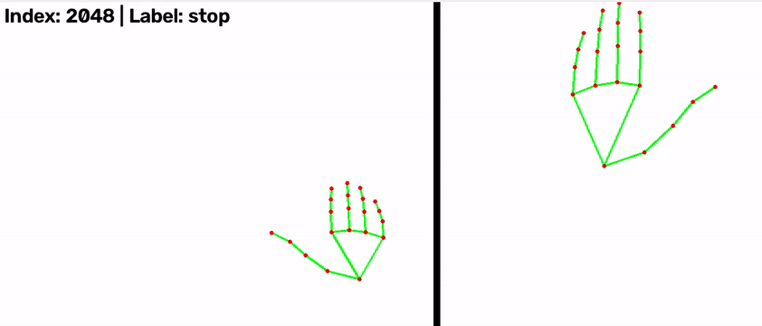
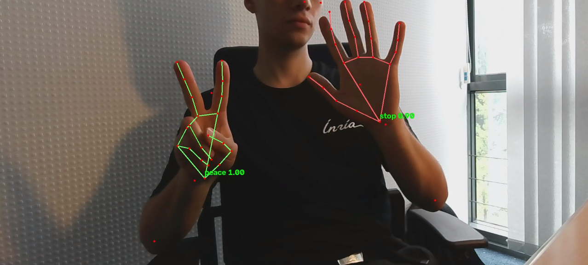

# Tutorial 07 - Pose & Action for HRI

Hands-on tutorial: detect a person with a whole-body pose estimator, recognize
hand gestures, and make the Reachy Mini robot react. 

For Part 1 and Part 2 you may use either the robot's camera or your own with the option `--use_input webcam`

```bash
make run     # start the daemon container (once)
make shell   # open a shell inside it (python = the right environment)
```

All commands below are run from **inside the container**:

## Whole-body pose estimator (used by Parts 1-4)

The live demos use the **RTMLib** whole-body pipeline (`tutorial/rtmlib/`).
We use the plain source code (no install) with a slightly modified version of the library. You may customize it.
It detects a person first, then predicts a pose with **133 keypoints** (body,
face, and both hands).

From that single prediction we extract:
- **hands** (21 keypoints per hand) for gesture classification,
- **face** (bounding box from face landmarks) for head tracking or mirroring.

Recent docker images ship the whole-body ONNX models in `/app/downloads/`.
If you use an older image, see **Troubleshooting** below.

Shared helpers live in:
- `keypoints_utils.py` — drawing, hand/face bounding boxes
- `handkeypoints_dataset.py` / `handkeypoints_models.py` / `handkeypoints_infer.py` — Part 2 classifier

## Part 1 - Whole-body detection + keypoints

In this part you will run the RTMLib whole-body pipeline live and draw the
detected skeleton on each frame.

Before coding, you can see how the detection, pose estimation, tracking is wired:
- `tutorial/rtmlib/tools/solution/pose_tracker.py` — `PoseTracker` (person detection + pose on each box)
- `tutorial/rtmlib/tools/solution/wholebody.py` — `Wholebody` solution (133 keypoints: body, face, hands)
- `tutorial/rtmlib/visualization/skeleton/coco133.py` — `coco133` to see the full skeleton structure (we dont use it directly)

The model outputs **133 keypoints per person**. Shared index constants live in
`keypoints_utils.py` (`BODY_IDS`, `FACE_IDS`, `LEFT_HAND_IDS`, `RIGHT_HAND_IDS`, …).

### Step 1 — Verify the detector

Run the script as-is (visualization is commented out). You should see shape
prints in the terminal, e.g. `(N, 133, 2)` for keypoints.

### Step 2 — Complete `keypoints_utils.py`

1. **`draw_hand_edges()`** — for each edge in `edges`, draw a line between the
   two keypoints when both are visible; then draw a small circle on each visible
   joint (`cv2.line`, `cv2.circle`).
2. **`draw_skeleton()`** — pick `HAND21_EDGES_MEDIAPIPE` or `HAND21_EDGES_COCO133`
   from `hands_style`, then call `draw_hand_edges` for the left and right hand
   slices (`kpts[LEFT_HAND_IDS]`, `kpts[RIGHT_HAND_IDS]`).

### Step 3 — Complete `visualize_wholebody_live.py`

Uncomment the block marked `PART 1 EXERCISE` and fill in the missing arguments
to `draw_skeleton`, `get_hand_bbox`, `get_face_bbox`, and `draw_label`.

The necessary wrist-gating logic is already there: if a wrist score is below the threshold,
all keypoints of that hand are zeroed out (the model sometimes swaps left/right).

### Expected result


Body joints, colored hand skeletons (blue = left, green = right), and bounding
boxes around hands and face. A label shows the people count.


```bash
# Run the whole-body detector live on the robot camera
python tutorial/visualize_wholebody_live.py

# Run the whole-body detector live on the USB camera / webcam
python tutorial/visualize_wholebody_live.py --use_input webcam

# Optional: try mediapipe-style or coco133-style hand drawing
python tutorial/visualize_wholebody_live.py --hands_style mediapipe
```


## Part 2 - Gesture classification

The classifier is trained on **MediaPipe-style 21-point hands** from HaGRID.
At runtime, hand keypoints are sliced from the whole-body prediction.
Pre-extracted splits live in `tutorial/data/hagrid_keypoints/` (8 gesture classes).
See the optional section below to rebuild them from the original HaGRID annotations.

All exercises are in:
- `handkeypoints_dataset.py` — `normalize_keypoints`, `flip_keypoints`, `HandKeypointDataset`
- `handkeypoints_models.py` — `HandMLP` and/or `HandGCN`


### Step 1 — Explore the raw data

```bash
python tutorial/visualize_hagrid_data.py
```

This script will only work fully once Steps 2–3 are done. Until then, read the
raw `.npz` layout: `X` is `(N, 21, 2)` keypoints in image-normalized `[0, 1]`
coordinates, `y` is the gesture index.

### Step 2 — `normalize_keypoints()` in `handkeypoints_dataset.py`

Center the hand on the wrist (keypoint 0), then divide by the largest
wrist-to-joint distance so the shape is scale-invariant. Values end up roughly
in `[-1, 1]`.

### Step 3 — `flip_keypoints()` and `HandKeypointDataset.__getitem__`

- **`flip_keypoints()`** — mirror the hand horizontally (negate x; wrist stays at origin).
- **`__getitem__()`** — always call `normalize_keypoints`; when `augment=True`,
  flip randomly with probability 0.5.

Re-run the visualizer: left = raw sample, right = processed / augmented sample.



### Step 4 — Models in `handkeypoints_models.py`

Pick one or both:

- **`HandMLP`** — flatten `(21, 2)` → 42 numbers, then a small MLP
  (recommended: 128 → 64 hidden units, ReLU, dropout 0.2).
- **`HandGCN`** — build the normalized adjacency `A_hat` from `HAND21_EDGES_MEDIAPIPE`
  (see `illustrations/gcn_ref.png`), then two graph-conv layers + mean pooling.

```bash
# Train the classifier (try mlp or gcn)
python tutorial/handkeypoints_train.py --model mlp
python tutorial/handkeypoints_train.py --model gcn
```

Expected test accuracy: ~0.85 with GCN, >0.95 with MLP.
The best checkpoint is saved to `tutorial/weights/gesture_classifier.pt`.

### Step 5 — Live classification demo

```bash
python tutorial/visualize_pose_classification_live.py
python tutorial/visualize_pose_classification_live.py --use_input webcam
```



## Part 3 - Run SixDRepNet demo

Just run the demo and take a look at `tutorial/SixDRepNet/main.py` to see the processing step. 
We will replace the face detection model by the keypoints based face detection implemented in Part 1. 

Standalone head-pose demo (not used directly by the live whole-body pipeline):

```bash
python tutorial/SixDRepNet/main.py --demo
```

## Part 4 - Gesture-driven robot behaviours

This part requires a Reachy. If everything went well this serves as a starting point for a demo with a moving robot !

Uses the whole-body estimator for hands and face. Choose a head-control mode
at launch:

- **tracking** — `peace` / `stop` start/stop following the face center
- **mirroring** — `peace` / `stop` start/stop mirroring head yaw (SixDRepNet)

```bash
python tutorial/visualize_interact_live_v2.py --mode tracking
python tutorial/visualize_interact_live_v2.py --mode mirroring
```

Gesture → behaviour:
- `point` → (reserved) / `mute` → stop sounds
- `rock` → open antennas / `fist` → close antennas
- `peace` → start head control / `stop` → stop head control
- `hand_heart` (both hands) → wave the head


# Part 5 - Customize and improve !

Now you can customize and improve the demo, some suggestions :

- Heart sign with both hands : 
  - improve it so that is triggers only when the hands are touching [visualize_interact_live_v2](visualize_interact_live_v2.py#358)
  - change the behavior such that it triggers only when two different persons are doing it together [visualize_interact_live_v2](visualize_interact_live_v2.py#356)


- Improve gesture recognition quality (Step 2.) :
  - Update network architectures (`handkeypoints_models.py`)
  - Update training parameters and retrain (`handkeypoints_train.py`)
  - Add new data augmentation strategies, 


- Change the detected gesture list and/or increase dataset size (Step 2.) :
  - See section `(Optional) Instructions to download and prepare the HaGRID data` and download raw data (~500MB). Reference at [https://github.com/hukenovs/hagrid](https://github.com/hukenovs/hagrid).
  - Update data preparation script and the list of gestures (`prepare_hagrid_dataset.py`, `keypoints_utils.py`)


- Update robots behavior and the orchestration logic. 
> [!NOTE]
> Note that the robot is controled through `target_yaw`, `target_pitch` and antennas positions with Reachy's `set_target` interface, if necessary make sure to handle the interpolation in the code yourself.
  - The "heart detected" behavior is a simple wave on the `target_yaw` you can improve it in [visualize_interact_live_v2](visualize_interact_live_v2.py#384)
  - Change the tracking target to use a hand instead of a face in [visualize_interact_live_v2](visualize_interact_live_v2.py#395)

- Implement a more advanced tracker in `rtmlib` and display track ids (*harder*s)
  -  The tracking logic is by default a simple greedy IoU tracker `rtmlib/tools/solution/pose_tracker.py` [PoseTracker](rtmlib/tools/solution/pose_tracker.py.py#275)


## (Optional) Instructions to download and prepare the HaGRID data

Download the dataset (out of the docker)
```bash
wget https://rndml-team-cv.obs.ru-moscow-1.hc.sbercloud.ru/datasets/hagrid_v2/annotations_with_landmarks/annotations.zip
unzip annotations.zip
mv annotations HaGRIDv2_annotations
```

Prepare keypoints (from the docker a compatible environment)
```bash
# Build the Part 2 gesture dataset from the HaGRID annotations (no downloads,
# uses the keypoints already stored in HaGRIDv2_annotations/).
python tutorial/prepare_hagrid_dataset.py
```

Then the processed data will be pushed on the github in `tutorial/data/`.
The trained gesture classifier can be saved to `tutorial/weights/gesture_classifier.pt`.
For mirroring mode, `tutorial/SixDRepNet/weights/best.pt` is also required.

## Troubleshooting

- If you pulled or built the docker **before 08/07/2026**, the whole-body ONNX models are not baked into the image. Either rebuild (`make build`) or do the following (faster):

```bash
# 1. On the host (outside the docker): download and extract the models into tutorial/
mkdir -p tutorial
cd tutorial
wget https://download.openmmlab.com/mmpose/v1/projects/rtmposev1/onnx_sdk/yolox_m_8xb8-300e_humanart-c2c7a14a.zip
wget https://download.openmmlab.com/mmpose/v1/projects/rtmw/onnx_sdk/rtmw-x_simcc-cocktail13_pt-ucoco_270e-384x288-0949e3a9_20230925.zip
unzip yolox_m_8xb8-300e_humanart-c2c7a14a.zip -d yolox_det
unzip rtmw-x_simcc-cocktail13_pt-ucoco_270e-384x288-0949e3a9_20230925.zip -d rtmw_pose
mv "$(find yolox_det -name end2end.onnx)" yolox_m_8xb8-300e_humanart-c2c7a14a.onnx
mv "$(find rtmw_pose -name end2end.onnx)" rtmw-x_simcc-cocktail13_pt-ucoco_270e-384x288-0949e3a9_20230925.onnx
rm -rf *.zip yolox_det rtmw_pose
cd ..

# 2. Inside the docker: move them to /app/downloads/ (where the live scripts look)
make shell
mkdir -p /app/downloads
mv /app/tutorial/yolox_m_8xb8-300e_humanart-c2c7a14a.onnx /app/downloads/
mv /app/tutorial/rtmw-x_simcc-cocktail13_pt-ucoco_270e-384x288-0949e3a9_20230925.onnx /app/downloads/

# 3. Install onnxruntime-gpu and fix LD_LIBRARY_PATH
source tutorial/update.sh
```

Note: `/app/downloads/` is not bind-mounted, so if you recreate the container you must repeat step 2 (the `.onnx` files stay on the host in `tutorial/`).


- If you have issues with "permission denied" for video devices (integrated or usb webcam). Outside of the docker, first make sure you did the `make install-rules` mentionned in repository README. 
Then do the following :
```
ls -la /dev/video*
sudo chmod 666 /dev/video2   # replace with your desired cam device
```

## References

### Whole-body pose (Parts 1–4)

- **RTMLib** — lightweight ONNX runtime wrapper used in this tutorial  
  [https://github.com/Tau-J/rtmlib](https://github.com/Tau-J/rtmlib)

- **MMPose** — OpenMMLab pose estimation toolbox  
  [https://github.com/open-mmlab/mmpose](https://github.com/open-mmlab/mmpose)

- **RTMPose** — real-time multi-person pose estimation (base architecture)  
  Jiang et al., *RTMPose: Real-Time Multi-Person Pose Estimation based on MMPose*, arXiv:2303.07399  
  [https://arxiv.org/abs/2303.07399](https://arxiv.org/abs/2303.07399)

- **RTMW** — whole-body model used here (133 keypoints: body, face, hands, feet)  
  Jiang et al., *RTMW: Real-Time Multi-Person 2D and 3D Whole-body Pose Estimation*, arXiv:2407.08634  
  [https://arxiv.org/abs/2407.08634](https://arxiv.org/abs/2407.08634)

- **YOLOX** — person detector in the top-down pipeline  
  Ge et al., *YOLOX: Exceeding YOLO Series in 2021*, arXiv:2107.08430  
  [https://arxiv.org/abs/2107.08430](https://arxiv.org/abs/2107.08430) · [https://github.com/Megvii-BaseDetection/YOLOX](https://github.com/Megvii-BaseDetection/YOLOX)

- **COCO-WholeBody** — 133-keypoint annotation format  
  Jin et al., *Whole-Body Human Pose Estimation in the Wild*, ECCV 2020, arXiv:2007.11858  
  [https://arxiv.org/abs/2007.11858](https://arxiv.org/abs/2007.11858) · [https://github.com/jin-s13/COCO-WholeBody](https://github.com/jin-s13/COCO-WholeBody)

### Gesture classification (Part 2)

- **HaGRID** — original hand gesture dataset  
  Kapitanov et al., *HaGRID — HAnd Gesture Recognition Image Dataset*, WACV 2024  
  [https://arxiv.org/abs/2206.08219](https://arxiv.org/abs/2206.08219) · [https://github.com/hukenovs/hagrid](https://github.com/hukenovs/hagrid)

- **HaGRIDv2** — extended dataset (annotations with landmarks used in this tutorial)  
  Nuzhdin et al., *HaGRIDv2: 1M Images for Static and Dynamic Hand Gesture Recognition*, arXiv:2412.01508  
  [https://arxiv.org/abs/2412.01508](https://arxiv.org/abs/2412.01508)

- **MediaPipe hand topology** — 21-keypoint hand skeleton used for drawing and the GCN graph  
  [https://developers.google.com/mediapipe/solutions/vision/hand_landmarker](https://developers.google.com/mediapipe/solutions/vision/hand_landmarker)

- **GCN** — graph convolution layer in `HandGCN`  
  Kipf & Welling, *Semi-Supervised Classification with Graph Convolutional Networks*, ICLR 2017, arXiv:1609.02907  
  [https://arxiv.org/abs/1609.02907](https://arxiv.org/abs/1609.02907)

### Head pose (Parts 3–4)

- **6DRepNet / SixDRepNet** — head pose estimation for mirroring mode  
  Hempel et al., *6D Rotation Representation for Unconstrained Head Pose Estimation*, ICIP 2022, arXiv:2202.12555  
  [https://arxiv.org/abs/2202.12555](https://arxiv.org/abs/2202.12555) · [https://github.com/thohemp/6DRepNet](https://github.com/thohemp/6DRepNet)

  Extended journal version: Hempel et al., *Toward Robust and Unconstrained Full Range of Rotation Head Pose Estimation*, IEEE TIP 2024  
  [https://arxiv.org/abs/2309.07654](https://arxiv.org/abs/2309.07654)